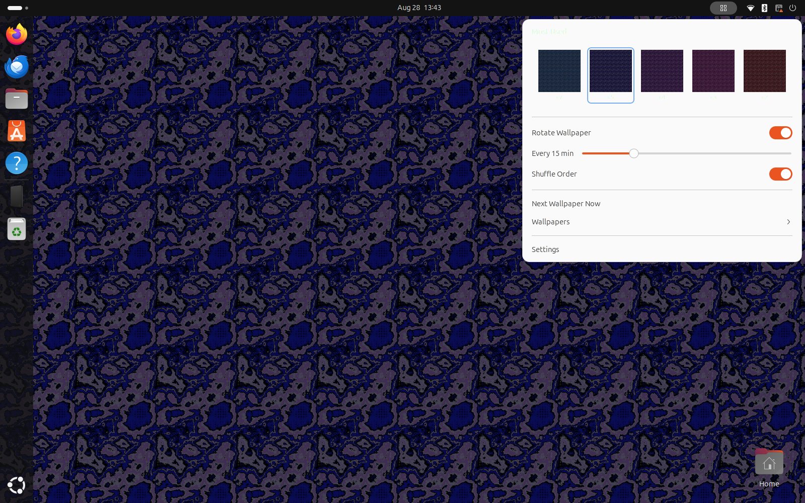

# Wallfred

*Your desktop's wallpaper valet.*



Wallfred is a GNOME Shell extension that puts a small grid icon in the top
panel. Click it and he presents your wallpapers as thumbnails; pick one and
it's on the desktop at once. Ask him to, and he'll quietly rotate through a
folder every **1–60 minutes** — and he keeps a discreet ledger of the ones you
choose most, surfacing them in a **Most used** row for quick access.

No root, no restart: setting a wallpaper is a single write to
`org.gnome.desktop.background` (`picture-uri` + `picture-uri-dark`), so light
and dark modes both update instantly.

Built for the GNOME 45+ ESM extension format (developed on GNOME 46, X11).

## What he does

- **Thumbnail picker** — the panel menu shows a **Most used** row on top and a
  collapsible **Wallpapers ▸** submenu with a thumbnail grid of the whole
  folder. Thumbnails use GNOME's own cache (`~/.cache/thumbnails`), so large
  images never get decoded at full size in the Shell.
- **Carousel** — a **Rotate wallpaper** switch and a **1–60 minute** slider.
  The timer is a `GLib.timeout_add_seconds` source, always torn down on
  `disable()`. Default interval is 30 minutes; rotation starts off.
- **Shuffle or sequential** — random (never repeating the current wallpaper) or
  alphabetical.
- **Favourites that learn** — every explicit pick bumps a per-wallpaper counter
  (automatic rotations don't count), and the top five bubble up to the
  **Most used** row. Reset the counts from the preferences window.

## Files

| Path | What |
|------|------|
| `metadata.json` | UUID, name, `shell-version`, schema id |
| `extension.js` | panel button, menu, carousel timer, usage tracking |
| `prefs.js` | Adwaita preferences (folder, interval, shuffle, rotate, reset) |
| `stylesheet.css` | thumbnail-grid styling |
| `schemas/…gschema.xml` | the settings; `gschemas.compiled` is built |
| `gnome-ext.sh` | the dev/install/test dispatcher |
| `docs/shell_extension.md` | the original design notes |

## Develop and test

Everything goes through `./gnome-ext.sh` (or `make`).

```bash
# Fully automatic, non-disruptive demo: a nested GNOME Shell in its own window
# with Wallfred enabled and the carousel running. Nothing touches your real
# desktop. Close the window to finish.
make test          # == ./gnome-ext.sh test

# Install into the real session (symlink + compiled schema):
make install
make reload        # X11: restart the shell in place; Wayland: log out/in
make enable
make prefs         # open the preferences window
make logs          # follow [Wallfred] lines from the shell journal

# Tear down:
make disable
make uninstall
```

Point Wallfred at a folder either in the preferences window, or at install
time: `CAROUSEL_DIR=/path/to/wallpapers make install`. With no folder set he
falls back to `~/Pictures/Wallpapers`.

`test` knobs (env vars): `TEST_INTERVAL` (minutes, default 1),
`NESTED_SIZE` (default `1600x1000`), `CAROUSEL_DIR`.

## Credits

Made to show off recoloured SGI IRIX pattern tiles from
[IRIX-wallpaper-tiles](https://github.com/sebastjan-rijavec/IRIX-wallpaper-tiles),
but Wallfred is happy to serve any folder of images.
